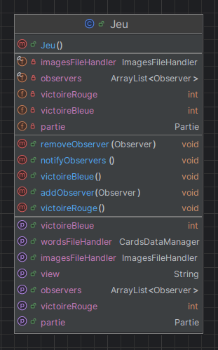
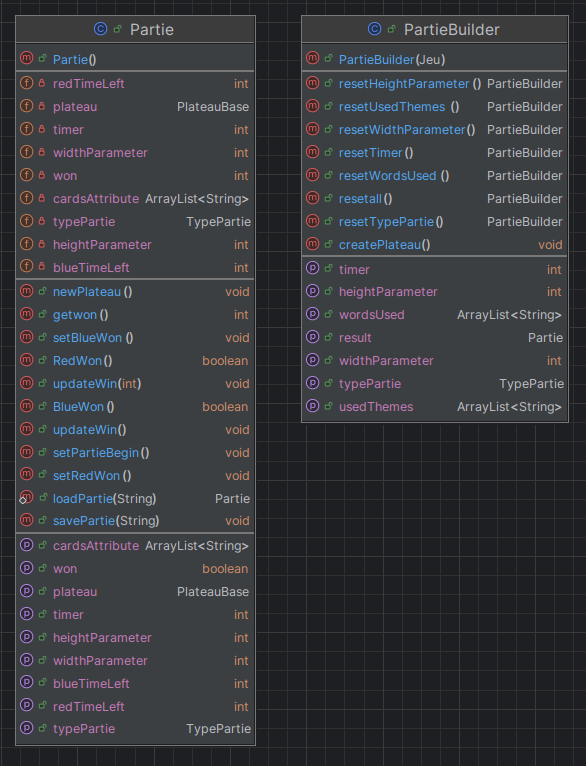
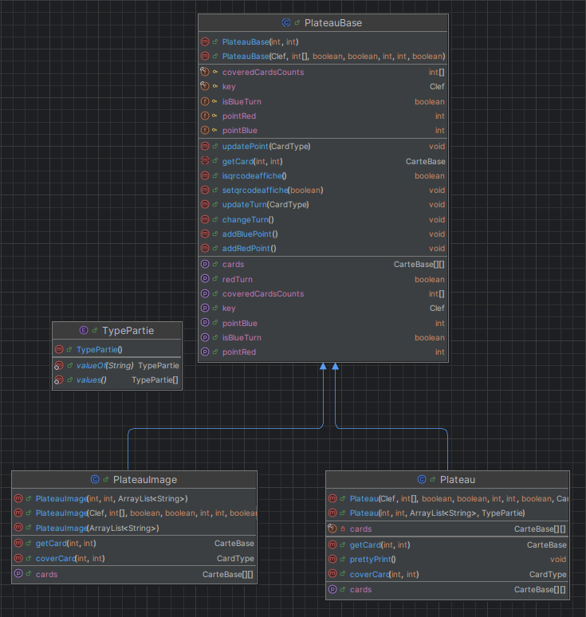
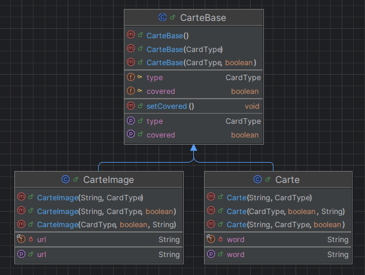
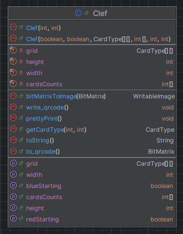
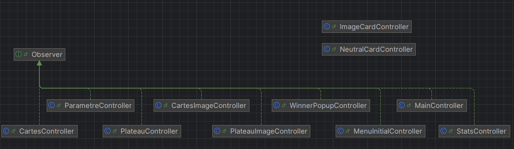

# Document d'analyse du code  

Le code fonctionne de la façon suivante : 

Une partie "model" gère la logique du jeu, avec une classe principale : Jeu, à partir de laquelle on a accès à tout ce qui 
concerne la logique du jeu : 

La logique de chaque partie est enregistrée dans une classe Partie que l'on peut construire avec un builder. 

Pour chaque partie, on fait un Plateau qui peut être ou un plateau avec des mots ou un plateau avec des images. 

Idem pour les objets Carte image et Carte mots.

Enfin, une clef unique est créée pour chaque partie. 

L'ensemble du diagramme de model, avec les dépendences entre les classes est visible dans image/package.png.

Les différentes vues sont implémentées avec fxml et javafx, elles implémentent toute l'interface Observer. 
Le passage d'une vue à une autre se fait grâce à la classe MainController. Les vues sont instanciées dans 
le fichier main. 

Les controlleurs pour les cartes sont différents car, contrairement aux autres, on crée plusieurs instances de ces objets.
Ils sont créés dans le code, hors du main. 

Une partie des fichiers est aussi déposée dans le dossier Util. Il est composé des fonctions qui ne font pas partie de 
la logique de jeu, mais qui sont utiles pour le code. 

Par exemple :
- ce qui nous sert à lire ou à écrire dans un fichier (pour charger des images, charger des cartes) 
- fichier de gestion des erreurs ...
